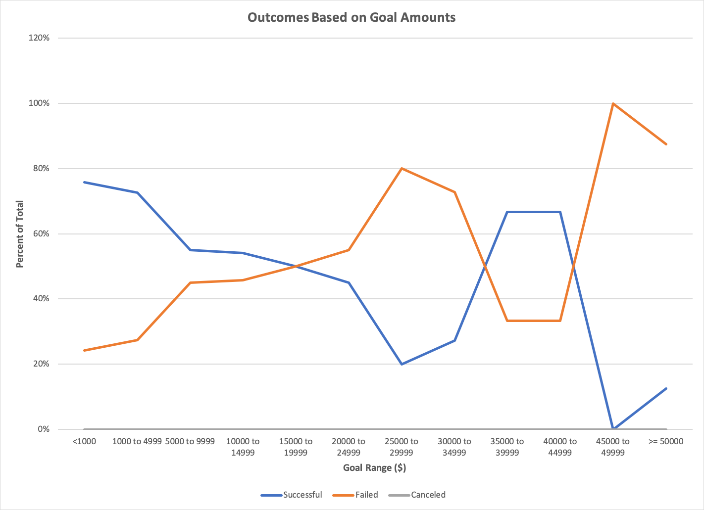
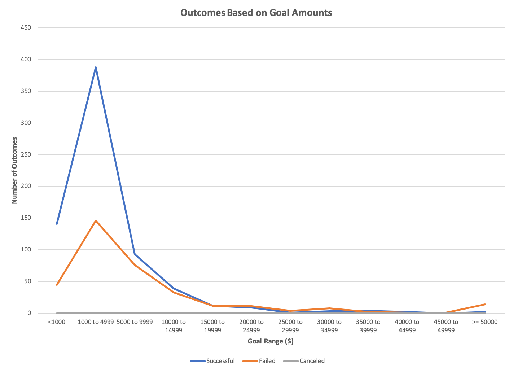
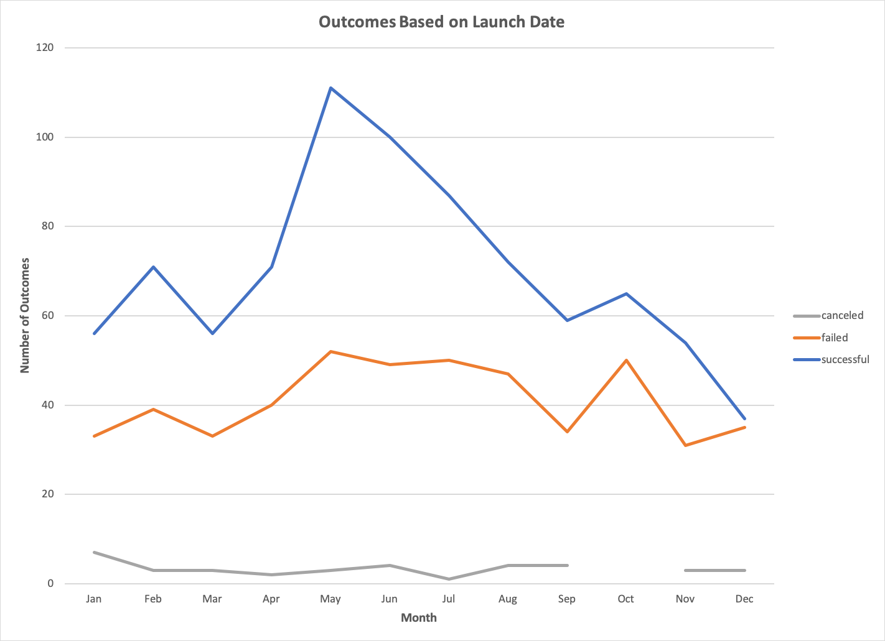

# An Analysis of Kickstarter Campaigns
## Goal: To determine trends in kickstarter campaigns in order to maximize success for a future campaign for a US based a play.
---
To start, I analyzed the outcomes of Kickstarter campaigns in the US based on their parent category.

From this, you can see that theater is the most popular category of kickstarter campaign to be initiated. It is also the most common category to be successful with 525 successful campaigns; however, the success rate of theater campaigns is lower than other categories such as music.

Next, I evaluated the breakdown of the outcomes of the theater parent category by their subcategory.

Plays were the most common type of theater kickstarter in the US and had a success rate of over 50%.

I then looked at outcomes based on launch date for Theater campaigns in the US.

Successful campaigns were more likely to be launched in the early summer (May-June) and less likely to be launched towards the end of the calendar year (November-December).

Finally, I performed a comparison of the goal amounts and pledged amounts of successful vs failed theater campaigns.

On average, successful campaigns had a more modest goal than failed ones suggesting that backers may appreciate a more modest goal. The mean successful goal was $5049. Many failed campaigns had very little pledged support suggesting that they failed to gain traction early on.

Link to full analysis:
[Kickstarter_Analysis](20200402-Kickstarter-Analysis.xlsx)

# Recommendations
- Look to launch a campaign in May when the number and rate of successful campaigns is highest.
- Aim for a budget of approximately $5000
- Try to maximize early momentum of backers which will attract further backers to the cause
- Be on the lookout for alternative funding oppotunities. Kickstarter plays in the US have a little over 50% baseline rate of being successful so while we are optimizing your chances, I would not recommend placing all your eggs in this basket.

---
### Challenge
The goal of this challenge was to analyze kickstarter data to determine trends in the goal amount as well as the launch date of the campaign.

The full analysis can be found here: [Challenge Analysis](Challenge/20200402-Challenge1-JW.xlsx)

#### Outcomes based on Goals
This analysis was designed to see if the goal amount of the campaign was correlated to the eventual outcome. To perform this analysis, I binned the goal amounts 12 categories (<$1000, $1000-$4999, and then $5000 increments until >$50,000) and checked the outcome for each campaign in these categories. For this analysis, I am displaying data only that corresponds to the subcategory "plays" and I am excluding the "live" outcome since this is essentially not yet determined. Additionally, I converted these values in percentages to determine the success, failure, or cancellation rate. These data are charted here:

Looking at the "plays" subcategory specifically, there are significantly fewer plays with high goal amounts. This means that our statistcal certainty for the calculated success rate will be much lower for the high goal amount campaigns. To appreciate the difference in number of campaigns, I have also graphed the outcomes based on number rather than percentage which can be found here:

#### Outcomes based on Launch Date
This analysis was designed to see if the launch date of the campaign had any relation to the eventual outcome of the campaign. To perform this analysis, I determined the calendar launch date for each campaign. I then used a pivot table to make a table of the outcomes broken down by the month that they were created. For this data, I filtered by the "theater" parent category. I also filtered out the "live" outcome since this is not a complete dataset and would not provide additional value to the analysis. These data are charted here:

#### Conclusions
1. Campaigns with more modest goals are more likely to be successful. There is a general downward trend of the successful campaigns (blue line) in the outcomes based on goals chart indicating that campaigns with lower goal amounts have a higher rate of success than those with higher goal amounts.
2. Campaigns launched in May are more likely to get funded. When tracking the outcomes by launch date, there is a clear peak in May for the number of successful campaigns (blue line). There is not a peak in the number of failed or canceled campaigns, indicating that a campaign launched at this time has a higher success rate.
3. Campaigns launched in December are less likely to get funded. When tracking outcomes by launch date, there is a clear dip in number of successful outcomes (blue line) in December. Meanwhile the number of failed and canceled campaigns is relatively stable, therefore a campaign launched in December will have a lower success rate.
#### Limitations
- This analysis is limited by the data that we have available to us. 
  - For example, while it looks like there is a downward trend in success rate based on goal amount, our data on higher goal "plays" is coming from very few data points and thus we cannot be as certain in these success rates. 
  - Additionally, if Louise were to seek benefactors through a mechanism other than Kickstarter, it is unclear if some of these trends would still be applicable or not.
  - Finally, we have location data that is stratified by country, but within the US we don't have additional location data. Louise's specific market may have trends that are different than the general US trends we are analyzing here.
- This data shows important correlations but isn't able to tell us why we are seeing these trends. For example, are fundings rates for theater higher in May because people like to go to the theater in the summer months more? Different types of data and analysis would be needed to get this order or insight.
- There may be important covariates in this data that drive the correlations that we are seeing. Depending on what they are, these covariates could ultimately be more insightful than the data analysis here.
#### Future Analyses
- What are the features that make campaigns with lower goal amounts more successful than those with higher goal amounts? Are all campaigns getting similar pledged amounts and those amounts are simply enough to make lower goal campaigns successful but not higher goal campaigns? This analysis could be done by comparing the goal and pledged amounts for successful and failed campaigns or by tracking the percent funded metric as it relates to goal amount.
- Can we identify important covariates in this data? This coudl be done by analyzing each dataset (column) and determining which tracks most closely with our outcomes.
- It would be helpful when designing campaigns to have more information on the backers. Are most backers supporting only one project or multiple projects? For backers which support multiple projects, how do their donation amounts differ across projects and are there features of projects that encourage a higher donation amount?
