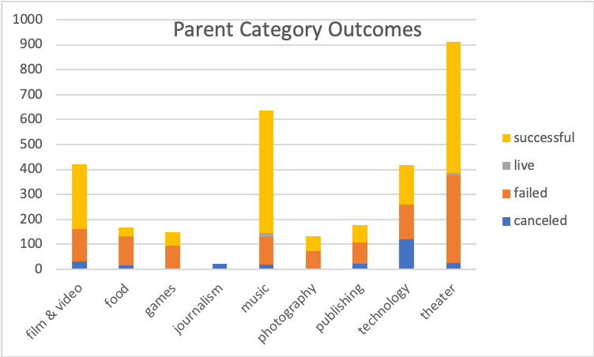
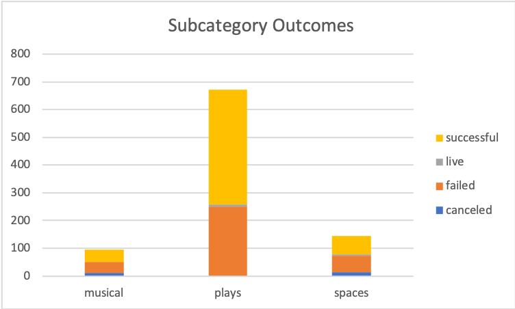

# An Analysis of Kickstarter Campaigns
## Goal: To determine trends in kickstarter campaigns in order to maximize success for a future campaign for a US based a play.
---
To start, I analyzed the outcomes of Kickstarter campaigns in the US based on their parent category.

From this, you can see that theater is the most popular category of kickstarter campaign to be initiated. It is also the most common category to be successful with 525 successful campaigns; however, the success rate of theater campaigns is lower than other categories such as music.

Next, I evaluated the breakdown of the outcomes of the theater parent category by their subcategory.

Plays were the most common type of theater kickstarter in the US and had a success rate of over 50%.

I then looked at outcomes based on launch date for Theater campaigns in the US.

Successful campaigns were more likely to be launched in the early summer (May-June) and less likely to be launched towards the end of the calendar year (November-December).

Finally, I performed a comparison of the goal amounts and pledged amounts of successful vs failed theater campaigns.

On average, successful campaigns had a more modest goal than failed ones suggesting that backers may appreciate a more modest goal. The mean successful goal was $5049. Many failed campaigns had very little pledged support suggesting that they failed to gain traction early on.

Link to full analysis:
[Kickstarter_Analysis](20200402-Kickstarter-Analysis.xlsx)

# Recommendations
- Look to launch a campaign in May when the number and rate of successful campaigns is highest.
- Aim for a budget of approximately $5000
- Try to maximize early momentum of backers which will attract further backers to the cause
- Be on the lookout for alternative funding oppotunities. Kickstarter plays in the US have a little over 50% baseline rate of being successful so while we are optimizing your chances, I would not recommend placing all your eggs in this basket.
